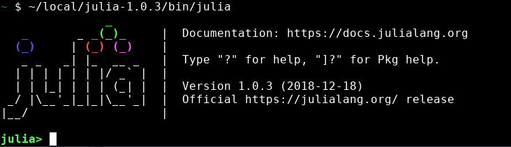

# Julia for Astronomers

The material in this repository grow out of a few talks entitled [Julia for Astronomers](https://gcalderone.github.io/JuliaForAstronomers/) I gave in Italy and Switzerland.  Here you will find all the code shown in the talks, as well as a brief introduction on how to start using Julia.

**IMPORTANT NOTE**: this file updated each time I have free time, so come back to check for new material.  Also, if you find any error, or would like to suggest new material, fell free to send me an email or submit a PR.

## What is Julia ?

Julia is a new, MIT-licensed (free and open source) and multiplatform (Linux, OSX, Windows) programming language specifically designed for numerical computation.  For Astronomers, the most important Julia features are:
- the very high performances, approaching that of C or FORTRAN.
- the ease of use;

Besides the above mentioned aspects Julia provides many further facilities, some of which will be discussed here.

The best places to start learning about Julia are:
- the reference website: https://julialang.org/;
- the official manual: https://docs.julialang.org/en/v1/;
- the community blog: https://discourse.julialang.org/;


The Julia concept and language design principles are discussed in [Bezanson et al 2012](http://karpinski.org/images/2012,bezanson,julia%20-%20a%20fast%20dynamic%20language%20for%20technical%20computing.pdf) and [Bezanson et al. 2017](http://karpinski.org/images/2017,bezanson,julia%20-%20a%20fresh%20approach%20to%20technical%20computing.pdf).


## Installing Julia and first run
Go to https://julialang.org/downloads/ and download the appropriate package.  Avoid installing versions prior to 1.0.

On Linux and OSX there is no need to install anything:
- *untar* the package wherever you want;
- add the `bin` directory to your `PATH` environment variable;
- type `julia` on a terminal and you're ready to go.
- alternatively open a terminal and type:
```
/the/complete/path/to/julia/bin/julia
```

On Windows run the installation program.

Your first contact with Julia will be through the [REPL](https://docs.julialang.org/en/v1/stdlib/REPL/#The-Julia-REPL-1) (Read-Eval-Print Loop), e.g.:


It is similar to a terminal and provides TAB completion, the typical Emacs-like shortcuts (Ctrl-a, Ctrl-e, Alt-b, Alt-f, Alt-l, Alt-c, etc.) as well as the common history search commands (Ctrl-s, Ctrl-r).

To be clear: TAB completion is that magical feature which allows you to type just a part of a function name, and have it Julia complete it for you by pressing the TAB key (provided the abbreviation is unique).

Try the following command:
```julia
julia> println("Hello world!")
```
that's it: you ran your first Julia program!

To check the online help for the `println` function you just used, type `?` (question mark), the prompt will turn yellow, then type `println` and enter.  The same applies to all other functions.

From within Julia you can also issue shell commands (only on Linux and OSX): simply type `;`, the prompt will turn red, type `ls` (or any other shell command) and enter.

Another *magic* key is `]`: it allows you to enter the builtin [package manager](https://julialang.org/blog/2018/09/Pkgtutorial).

In any of these modes simply hit the *backspace* key to go back to the Julia prompt.

To quit your Julia session simply hit `Ctrl-d`.


## Is Julia really fast?

Before tackling the actual comparison between Julia and other programming languages I'll show a very simple example taken from [Bezanson et al. 2017](http://karpinski.org/images/2017,bezanson,julia%20-%20a%20fresh%20approach%20to%20technical%20computing.pdf):

Let's define two very simple functions, `f(x)` and `g(x)`, as follows:
```julia
f(x) = 5x-1
function g(x)
    for i = 1:10
        x = f(x)
    end
    x
end
```
Can you guess what is the value of `g(1)` ?  and `g(2)` ?
In general, can you find a simple way to calculate `g(x)` for any value of `x`?

Well, Julia does it pretty easily!

Just type: `code_native(g, (Int,))`, you'll obtain:
```
imulq   $9765625, %rdi, %rax
addq    $-2441406, %rax
```
The above code is the *native* machine code being executed by your computer each time you call the `g(x)` function: a multiplication and an addition.  Believe it or not, Julia found the simple formula `-2441406 + 9765625 * x` to be the fastest way to calculate `g(x)`.


Now let's try the following code snippets calculating the sum of the square root of the first 500,000,000 integer numbers, in different languages:

### C
Type the following code in a file named `ex1.c`:
```C
#include <stdio.h>
#include <math.h>

double ex1(long int n) {
	long int i;
	double sum = 0.;
	for (i=1; i<=n; i++)
		sum += sqrt(i);
	return sum;
}

int main() {
	printf("%f\n", ex1(500000000));
}
```

Compile and run with:
```
gcc -O3 -o ex1 ex1.c -lm
time ./ex1
```

### Python

Explicit loop:
```python
import math
import time

def ex1(n):
    sum = 0.
    for i in range(1,n):
        sum += math.sqrt(i)
    return sum

elapsed = time.time()
print(ex1(500000000))
elapsed = time.time() - elapsed
print("Elapsed time: ", elapsed)
```

With Numpy:
```python
import numpy as np
import math
import time

def ex2(n):
    a = np.arange(n)+1
    a = np.sqrt(a)
    return np.sum(a)

elapsed = time.time()
print(ex2(500000000))
elapsed = time.time() - elapsed
print("Elapsed time: ", elapsed)
```

With Numba:
```python
from numba import jit
import math
import time

@jit
def ex3(n):
    sum = 0.
    for i in range(1,n):
        sum += math.sqrt(i)
    return sum

elapsed = time.time()
print(ex3(500000000))
elapsed = time.time() - elapsed
print("Elapsed time: ", elapsed)
```

### IDL

Explicit loop:
```idl
.r
FUNCTION ex1, n
  sum = 0.d
  FOR i=1l, n DO $
     sum += SQRT(i)
  RETURN, sum
END

elapsed = SYSTIME(1)
PRINT, ex1(500000000)
elapsed = SYSTIME(1) - elapsed
PRINT, 'Elapsed: ', elapsed
```

Implicit loop:
```idl
.r
FUNCTION ex2, n
  RETURN, TOTAL(SQRT(DOUBLE(LINDGEN(n)+1)))
END

elapsed = SYSTIME(1)
PRINT, ex2(500000000)
elapsed = SYSTIME(1) - elapsed
PRINT, 'Elapsed: ', elapsed
```


### Julia

Explicit loop:
```julia
function ex1(n)
    sum = 0.
    for i in 1:n
        sum += sqrt(i)
    end
    return sum
end

println(ex1(2))  # warm up
@time println(ex1(500_000_000))
```

Implicit loop:
```julia
function ex2(n)
    return sum(sqrt, 1:n)
end

println(ex2(2))  # warm up
@time println(ex2(500_000_000))
```
Notice there is no significant difference between the explicit and implicit loop versions!


Parallel processing (start julia with: `julia -p 4`):
```julia
using Distributed
function ex3(n)
    return @distributed (+) for i = 1:n
        sqrt(float(i))
    end
end

if myid() == 1
	println(ex3(2))  # warm up
    @time println(ex3(500_000_000))
end
```

Multithreading (start julia with: `JULIA_NUM_THREADS=4 julia`):
```julia
using Base.Threads
function ex4(n)
    arr = fill(0., nthreads())
    @threads for i = 1:n
        arr[threadid()] += sqrt(float(i))
    end
    return sum(arr)
end

println(ex4(2))
@time println(ex4(500_000_000))
```

## My first plot
To produce your first plot in Julia you should install one or more [plotting packages](https://juliaobserver.com/categories/Infographics) (see **Packages** section below).  My best choice is the [Gnuplot.jl](https://github.com/gcalderone/Gnuplot.jl/) package.

To install `Gnuplot.jl` you need to have a working [Gnuplot](http://gnuplot.info/) installation.  Then you can start julia, type the `]` character (start the package manager) and type:
```julia
add Gnuplot
```

Now you're ready for your first plot:
```julia
julia> using Gnuplot
julia> @gp 1:10
```

A slightly more interesting example:
```julia
julia> X = -3:0.1:3
julia> @gsp X X reshape([exp.(-x.^2 -y.^2) for x in X for y in X], length(X), length(X)) "w pm3d"
julia> save(term="png", output="MyFirstPlot.png")
```


Have a look at [Gnuplot.jl](https://github.com/gcalderone/Gnuplot.jl/) documentation for further examples.


## Packages

With the core Julia language you can only do slightly more than arithmetics, basic statistics, and simple input/outputs on files.  New functionalities must be added to Julia with custom **packages**.

The most trending packages are listed [here](https://github.com/trending/julia), while the complete list is available [here](https://juliaobserver.com/packages) (NOTE: Julia package usually have the `.jl` suffix).  Be aware that many of the packages are no longer maintained since the Julia language evolved rather quickly in the last few years introducing important breaking changes.  Since August 2018 versin 1.0 is released, and there shouldn't be any other breaking change in the future, hence the package ecosystem will soon settle on its long term state.

There are many useful packages available online.  The ones I think are mandatory to start being proficient in Julia are the one listed below.  Feel free to install as many packages as you like, the package manager will take proper care of all the dependencies, and you can always delete them later if you find they are not useful.

The code to install the minimum set of packages is as follows (remember to activate the package manager by pressing the `]` button):
```julia
add DataFrames TextParse StatsBase Images ImageMagick ImageView TestImages
add FITSIO AstroLib WCS CoordinateTransformations
dev SkyCoords
add Gnuplot SortMerge
dev https://github.com/gcalderone/AstroRecipes.jl
```

The `add` command downloads the latest *stable* version of the package, while `dev` downloads the latest package commit.  For instance, the `AstroRecipes` is currently not supposed to have stable releases since it is evolving very quickly, hence we use the development version.  Both commands install also the appropriate dependencies.

If you wish to check and download new versions of the installed packages simply use the `update` command (as always, use the `]` character to activate the package manager).

The first time you use these packages you may see Julia freezing for ~tens of seconds, since it is precompiling the associated modules.  This is perfectly normal, and is done only once.


## Read a FITS file and show an image

Download a FITS file containing an image extension (e.g. [here](https://www.spacetelescope.org/static/projects/fits_liberator/datasets/eagle/502nmos.zip), to be unzipped...), then from Julia:
```julia
using FITSIO, ImageView
f = FITS("502nmos.fits")
imshow(read(f[1]))
```
use the right mouse button to open the `Contrast` window. Then use `Ctrl+` mouse wheel to zoom in and out, and drag with the left button to pan the image.  Finally, with `Ctrl+` left button you may zoom in a specific region of the image.
